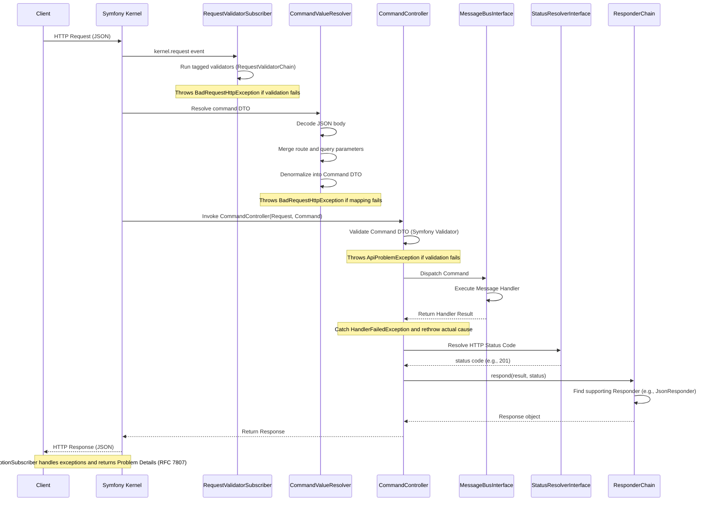

# Command routing (OpenAPI-driven, no Symfony #[Route] needed on commands)

This bundle lets you build HTTP APIs around Command Bus messages (command DTOs) without writing controllers for each endpoint and without using Symfony’s #[Route] on the command classes. Instead, you declare OpenAPI operation attributes (from swagger-php) directly on your command DTOs and the bundle generates Symfony routes at compile time. A single CommandController handles the request lifecycle (deserialization, validation, dispatch, response) by default, with optional per-route overrides.

Declaring routes on commands is supported via:

- OpenAPI operation attributes on your command classes (non-controllers), such as #[OA\Post], #[OA\Get], #[OA\Put], #[OA\Patch], #[OA\Delete], etc. The path and HTTP method(s) are taken from these attributes, and the optional operationId becomes the route name.

This coexists with classic Symfony route configuration (YAML/PHP/XML). Choose what fits your project.


## Prerequisites

- Symfony 7.3+
- This bundle installed and enabled
- Your command classes are registered as services (typical with autowire/autoconfigure)

Important: Commands must NOT be controllers
- Do not extend Symfony\Bundle\FrameworkBundle\Controller\AbstractController in your command classes.
- Do not use #[Symfony\Bundle\FrameworkBundle\Controller\Attribute\AsController] on your command classes.
- The bundle excludes real controllers determined by: inheritance from AbstractController, presence of #[AsController], or having method‑level #[Route] attributes (controllers typically define #[Route] on methods). Command DTOs use only OpenAPI attributes at class level.


## Request lifecycle

The following sequence diagram illustrates the lifecycle of a request handled by the **OpenAPI Command Bundle**, from the initial HTTP request to the final response.



## No extra routes configuration required

Starting with this version, you do not need to add any custom route import for command DTOs.

How it works
- The bundle decorates Symfony’s `AttributeDirectoryLoader` (the same mechanism used to load controller routes from attributes).
- During the normal route building process, we automatically scan your project’s `%kernel.project_dir%/src` directory and add routes for command classes that meet the criteria: have class-level OpenAPI operation attributes (e.g., `#[OA\Post]`, `#[OA\Get]`, …) and are not controllers.
- This happens once per router build and coexists with your existing controller routes and any manually configured routes.


Notes
- No additional routing import is necessary. The bundle augments the standard attribute route loading automatically.
- The scan is recursive and limited to `%kernel.project_dir%/src`.
- Only classes that are annotated with OpenAPI operation attributes (e.g., `#[OA\Post]`) at class level and are not recognized controllers (`AbstractController`, `#[AsController]`, or having method-level `#[Route]`) will produce routes.
  - Because of this, ensure your commands are plain DTOs and do not extend `AbstractController`, do not use `#[AsController]`, and do not declare method-level `#[Route]` attributes.


## Use OpenAPI attributes on command classes (no Symfony #[Route])

Place OpenAPI operation attributes on your command DTOs. They do not become controllers; the bundle still routes to CommandController by default. You can optionally override the controller per operation using an OpenAPI vendor extension or by annotating the command class with #[CommandObject(controller: ...)].

```php
use OpenApi\Attributes as OA;
use Stixx\OpenApiCommandBundle\Attribute\CommandObject;

#[CommandObject] // optional – you can also set a custom controller here
#[OA\Post(path: '/api/employees', operationId: 'add_employee', summary: 'Add employee')]
final class AddEmployeeCommand
{
    public function __construct(
        public string $firstName,
        public string $lastName,
        public string $email,
    ) {}
}

#[OA\Delete(path: '/api/employees/{uuid}', operationId: 'remove_employee', summary: 'Remove employee')]
final class RemoveEmployeeCommand
{
    public function __construct(public string $uuid) {}
}
```

Override the controller via OpenAPI vendor extension:

```php
#[OA\Post(path: '/api/import', operationId: 'import_data', x: ['controller' => App\\Controller\\CustomCommandController::class])]
final class ImportDataCommand {}
```

Or via a class-level CommandObject attribute (not visible in the generated OpenAPI):

```php
#[CommandObject(controller: App\\Controller\\CustomCommandController::class)]
#[OA\Post(path: '/api/import', operationId: 'import_data')]
final class ImportDataCommand {}
```

Notes
- Real controllers are not affected. The bundle uses a precompiled list of controller classes based on: AbstractController inheritance, #[AsController], or method-level #[Route].
- Only classes that declare class-level OpenAPI operations are considered for routing discovery.


## Coexistence with classic route config

You can keep writing routes manually in YAML/PHP. The bundle’s attribute-based routes will happily coexist. If the same route name is declared multiple times, Symfony will apply its usual conflict rules; the bundle also ensures uniqueness when it autogenerates names.


## Handling the HTTP request

All generated routes point to a single controller: Stixx\OpenApiCommandBundle\Controller\CommandController.

Request-to-command mapping
- Body: If the request contains a non-empty body, it must be JSON (`application/json` or `+json`). The body is denormalized into your command DTO via Symfony Serializer.
- No body / Merging: The `CommandValueResolver` collects scalar values from route placeholders and query parameters and merges them with the body data (if any) to build the command. If nothing mappable is found, a 400 Bad Request might be thrown depending on the command's requirements.

Validation
- By default, the bundle validates the deserialized command via Symfony Validator before dispatching it.
- Configure validation via bundle options (validation groups, toggle HTTP validation).

Dispatch and response
- The command is dispatched on the Messenger bus. The response status code is resolved by `Stixx\OpenApiCommandBundle\Response\StatusResolverInterface` based on request/command; the response is handled by a chain of responders implementing `Stixx\OpenApiCommandBundle\Responder\ResponderInterface`.

---

## Customizing Responses (Responders)

By default, the bundle includes responders for JSON serialization, but you can extend this by adding your own custom responders. This is useful if you need to return different formats (e.g., CSV, XML) or handle specific return types from your message handlers.

### 1. Implement `ResponderInterface`

Create a class that implements `Stixx\OpenApiCommandBundle\Responder\ResponderInterface`:

```php
namespace App\Responder;

use Stixx\OpenApiCommandBundle\Responder\ResponderInterface;
use Symfony\Component\HttpFoundation\Response;

final class CsvResponder implements ResponderInterface
{
    public function supports(mixed $result): bool
    {
        // Return true if this responder can handle the result
        return is_array($result) && isset($result['format']) && $result['format'] === 'csv';
    }

    public function respond(mixed $result, int $status): Response
    {
        $csvData = $this->convertToCsv($result['data']);
        
        return new Response($csvData, $status, [
            'Content-Type' => 'text/csv',
        ]);
    }

    private function convertToCsv(array $data): string
    {
        // CSV conversion logic...
        return "column1,column2\nvalue1,value2";
    }
}
```

### 2. Tag your Service

Register your responder as a service and tag it with `stixx_openapi_command.response.responder`. With autoconfiguration enabled, the bundle automatically detects services implementing `ResponderInterface`.

```yaml
# config/services.yaml
services:
    App\Responder\CsvResponder:
        tags:
            - { name: 'stixx_openapi_command.response.responder', priority: 10 }
```

### How it works

The `ResponderChain` iterates through all registered responders and calls `supports($result)` on each. The first responder that returns `true` will be used to generate the `Response`. You can use the `priority` attribute in the tag to control the order of the responders.

---

## End-to-end example

Command
```php
use OpenApi\Attributes as OA;
use Symfony\Component\Validator\Constraints as Assert;

#[OA\Post(path: '/api/projects', operationId: 'project_create', summary: 'Create project')]
final class CreateProjectCommand
{
    public function __construct(
        #[Assert\NotBlank]
        public string $name,

        #[Assert\Length(max: 200)]
        public ?string $description = null,
    ) {}
}
```

Handler
```php
use Symfony\Component\Messenger\Attribute\AsMessageHandler;

#[AsMessageHandler]
final class CreateProjectHandler
{
    public function __invoke(CreateProjectCommand $command): array
    {
        // ... create and persist
        return ['id' => '123', 'name' => $command->name];
    }
}
```

Call
```
POST /api/projects
Content-Type: application/json

{"name":"Acme CMS","description":"Headless"}
```

Response
```
HTTP/1.1 201 Created
Content-Type: application/json

{"id":"123","name":"Acme CMS"}
```


## OpenAPI / NelmioApiDoc

The bundle provides a `CommandRouteDescriber` so your routes appear in Nelmio ApiDoc automatically. If you use Nelmio areas, the bundle also exposes a helper (`NelmioAreaRoutesChecker`) that can recognize whether a request targets a documented API route. Routes generated from OpenAPI attributes are compiled into Symfony’s router, so they are visible in `bin/console debug:router`.


## Migration note

The previously introduced AsCommandRoute attribute and the temporary Symfony #[Route]-on-command approach are no longer supported to avoid confusion. Use OpenAPI operation attributes on the command class instead. You may override the controller via an OpenAPI vendor extension (x: { controller: FQCN }) or via a class-level #[CommandObject(controller: ...)].

Note about CommandRouteTaggedPass
- Earlier versions compiled route metadata via a DI compiler pass (`CommandRouteTaggedPass`) into a container parameter consumed by a loader. The bundle now uses Symfony-style filesystem scanning with attribute loaders (`AttributeDirectoryLoaderDecorator` + `CommandRouteClassLoader`). `CommandRouteTaggedPass` is no longer registered or used at runtime; it remains in the codebase only for backward-compatibility reference and may be removed in a future major release.


## Troubleshooting

- My routes don’t show up
  - Verify your command classes are registered as services (autowire/autoconfigure setups usually cover this).
  - Ensure the command class declares a class-level OpenAPI operation attribute (e.g., #[OA\Post(path: ...)]).
  - Ensure the class is NOT detected as a real controller by the bundle’s rules: it must not extend `AbstractController`, must not use `#[AsController]`, and must not declare method-level `#[Route]` attributes.

- Symfony auto-tagged my command with controller.service_arguments
  - This is less likely now since commands no longer use `#[Route]`. If you still observe it due to your own service config, it won’t exclude the class unless it matches the refined rules (`AbstractController`, `#[AsController]`, or method-level `#[Route]`).

- 400 Bad Request: Unsupported Content-Type
  - When sending a body, set `Content-Type: application/json` (or a `+json` media type).

- Validation errors
  - The bundle validates command DTOs prior to dispatch; you’ll get a 400 with violation details when constraints fail.
